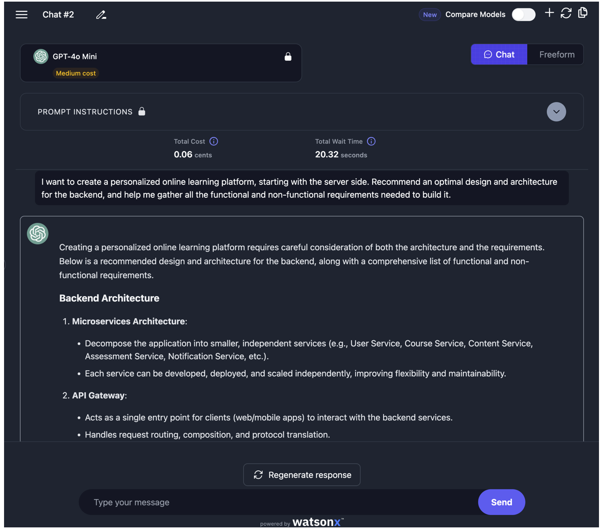
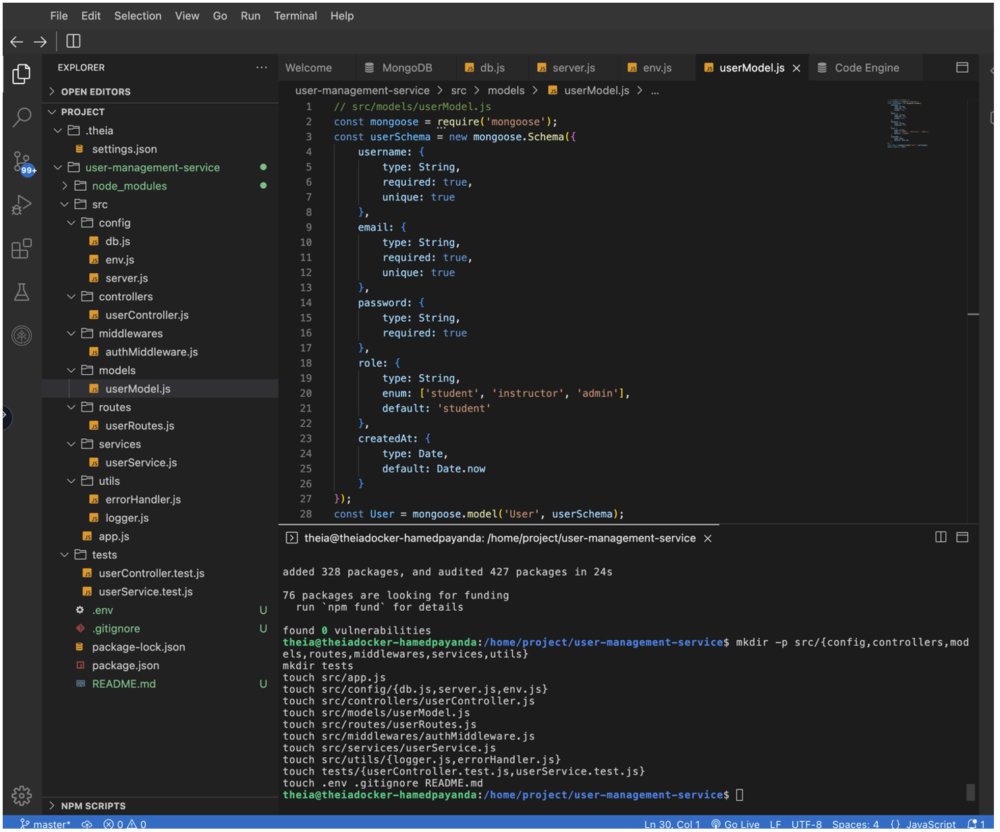
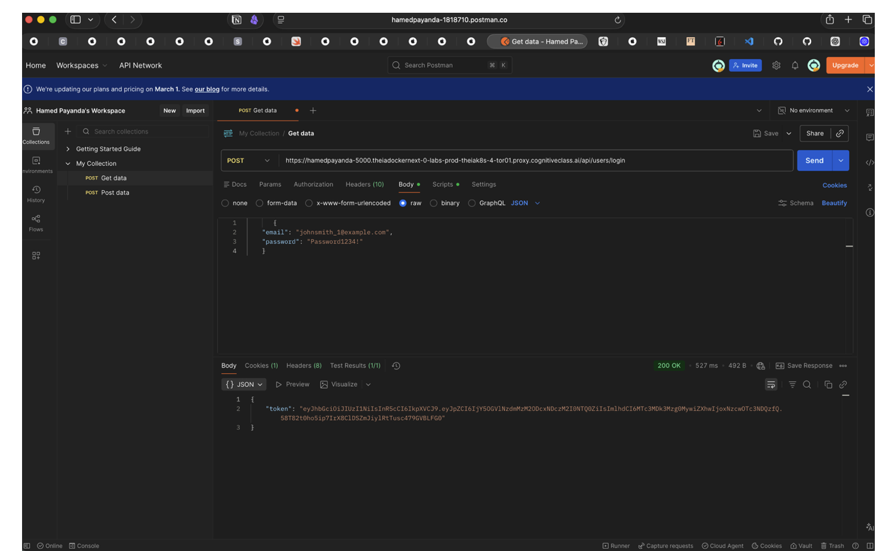
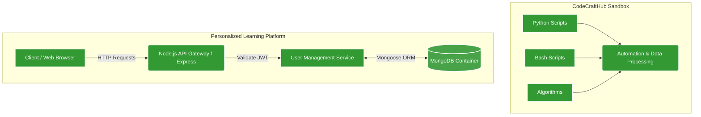

<div align="center">

# 🛠️ CodeCraftHub

A centralized repository and developer sandbox dedicated to software engineering projects, utility scripts, algorithms, and continuous learning.

[](https://www.python.org/)


[](#)

[](https://git-scm.com/)
[](https://www.coursera.org/professional-certificates/ibm-full-stack-cloud-developer)
[](#)

</div>

---

## 📌 Repository Overview

Welcome to **CodeCraftHub**! This repository serves as my personal development sandbox and master portfolio for software engineering experiments. It is designed to store, organize, and document various coding projects ranging from algorithmic problem-solving and automation scripts to full-stack application modules.
**CodeCraftHub** is a personalized learning platform for developers, built using  
**Node.js**, **MongoDB**, **Docker**, and **Generative AI**.

The platform is designed to deliver adaptive learning experiences by managing users,
enabling secure authentication, and providing a scalable server-side architecture
that can be extended with AI-driven recommendations and learning analytics.

This repository focuses on the **User Management Service**, a core backend
microservice responsible for user registration, authentication, authorization,
and secure data handling

The primary goal of this hub is to demonstrate clean code architecture, version control best practices, and a commitment to continuous technical improvement.

### 🛡️ Core Focus: User Management Service
Currently, this repository highlights the **User Management Service**, a foundational backend microservice designed to deliver adaptive learning experiences. It manages users, enables secure authentication, and provides a scalable server-side architecture that can be extended with AI-driven recommendations and learning analytics.

---

## 📸 Visual Proof

The following screenshots detail the project's development lifecycle, from initial architectural AI planning to local environment setup and API endpoint validation.

**1. AI-Assisted Architecture Planning**  
*Leveraging Generative AI (via watsonx) to conceptualize the initial backend design. The AI's output recommended a Microservices Architecture and an API Gateway, establishing the foundational blueprint and requirements for the platform.*


**2. Backend Development & Database Schema**  
*A look into the Cloud IDE workspace during the initial build phase. The terminal shows the robust directory scaffolding (`controllers`, `models`, `routes`, `services`, `utils`). The editor highlights the `userModel.js` file, demonstrating the Mongoose schema implementation with built-in role-based parameters (Student, Instructor, Admin).*


**3. API Testing & Secure JWT Generation**  
*Validating the authentication workflow using Postman. The screenshot captures a successful `POST` request to the `/api/users/login` endpoint. Upon verifying the email and password, the backend securely responds with an HTTP `200 OK` status and issues a JSON Web Token (JWT) for subsequent authenticated requests.*


---

## ✨ Key Features

* **Secure Authentication:** User registration and login utilizing JWT-based authentication.
* **Data Security:** Secure password hashing implemented using `bcrypt`.
* **Database Integration:** Seamless MongoDB integration using Mongoose ORM.
* **Scalable Design:** A highly modular and scalable backend microservices architecture.
* **Reliability:** Centralized logging and robust error handling.
* **Environment Security:** Environment-based configuration using `.env` variables.
* **Containerization:** Fully containerized deployment orchestrated with Docker & Docker Compose.

---
## 🏗️ System Architecture 

The following diagram illustrates how CodeCraftHub is split between utility modules and the containerized User Management microservice.



---

## 📁 Repository Structure

To maintain a clean and scalable codebase, projects within this hub are compartmentalized into specific domains.
1. General Hub Architecture
```text
CodeCraftHub/
├── automation-scripts/         # Bash and Python scripts for workflow automation
├── algorithms/                 # Data structures and algorithmic problem-solving
├── web-development/            # Front-end and back-end application modules
└── data-processing/            # Scripts for data parsing, cleaning, and analysis
```
2. User Management Service (Final Project Structure)

```text
project-root/
├── docker-compose.yml          # Docker Compose orchestration (Node.js + MongoDB)
├── user-management-service/
│   ├── src/
│   │   ├── config/             # Database, server, and environment configuration
│   │   ├── controllers/        # Request-handling logic
│   │   ├── middlewares/        # Authentication middleware
│   │   ├── models/             # MongoDB schemas
│   │   ├── routes/             # API route definitions
│   │   ├── services/           # Business logic layer
│   │   ├── utils/              # Logging and error handling utilities
│   │   └── app.js              # Application entry point
│   ├── tests/                  # Automated unit and API tests
│   ├── Dockerfile              # Docker image definition for Node.js service
│   ├── .env                    # Environment variables (not committed)
│   ├── .gitignore
│   ├── package.json
│   ├── package-lock.json
│   └── README.md               # Project documentation

Security Considerations
	•	Passwords are hashed before storage
	•	JWT tokens are used for secure authentication
	•	Environment variables protect sensitive configuration
	•	Centralized error handling prevents sensitive data exposure

⸻

Future Enhancements
	•	Role-based authorization
	•	AI-powered personalized learning recommendations
	•	Additional microservices (courses, exercises, analytics)
	•	Cloud deployment (Kubernetes / managed databases)

⸻

```
---

## 🛠️ Core Tech Stack

* **Backend Framework:**   — API routing, microservice architecture, and server logic.
* **Database:**  — NoSQL data storage and object modeling (`Mongoose`).
* **Containerization:**  — Application containerization and service orchestration (`Docker Compose`).
* **Scripting Languages:**   — Core logic, workflow automation, and data processing.
* **Security:** 🔐 **JWT & bcrypt** — Token-based authentication and secure password hashing.
* **Version Control:**   — Source code management and feature branching.

---


## ⚙️ How to Use This Repository
If you would like to explore or test any of the scripts and projects contained in this hub, follow these standard steps:
1. Clone the Hub
Download a copy of the repository to your local machine:
```bash
git clone [https://github.com/HAMED-PAYANDA/CodeCraftHub.git](https://github.com/HAMED-PAYANDA/CodeCraftHub.git)
cd CodeCraftHub
```
2. Navigate to a Specific Module
Move into the directory of the project you want to explore:
```bash
# Example: Navigating to the python automation scripts
cd automation-scripts
```

3. Execute the Code
Run the desired script using the appropriate runtime environment:
```bash
# For Python scripts:
python3 script_name.py

# For Bash scripts (ensure execution permissions are set):
chmod +x script_name.sh
./script_name.sh
```
---

## 🚀 Future Roadmap & Enhancements

•	[ ] Role-Based Authorization: Expand the User Management service to include granular RBAC capabilities.
•	[ ] AI-Powered Recommendations: Integrate generative AI to provide personalized learning paths.
•	[ ] Service Expansion: Add adjacent microservices (e.g., courses, exercises, and analytics).
•	[ ] Cloud Deployment: Deploy the containerized cluster using Kubernetes or managed cloud databases.
•	[ ] CI/CD Integration: Integrate Continuous Integration workflows using GitHub Actions.
•	[ ] TDD Implementation: Expand the algorithms section adhering strictly to test-driven development principles.

---

## 📄 License

This project is licensed under the [MIT License](LICENSE) - see the LICENSE file for details.

## 👤 Author

**Hamed Payanda**
* **GitHub:** [@HAMED-PAYANDA](https://github.com/HAMED-PAYANDA)
* Completed as part of the **IBM Full-Stack Software Developer Professional**.

